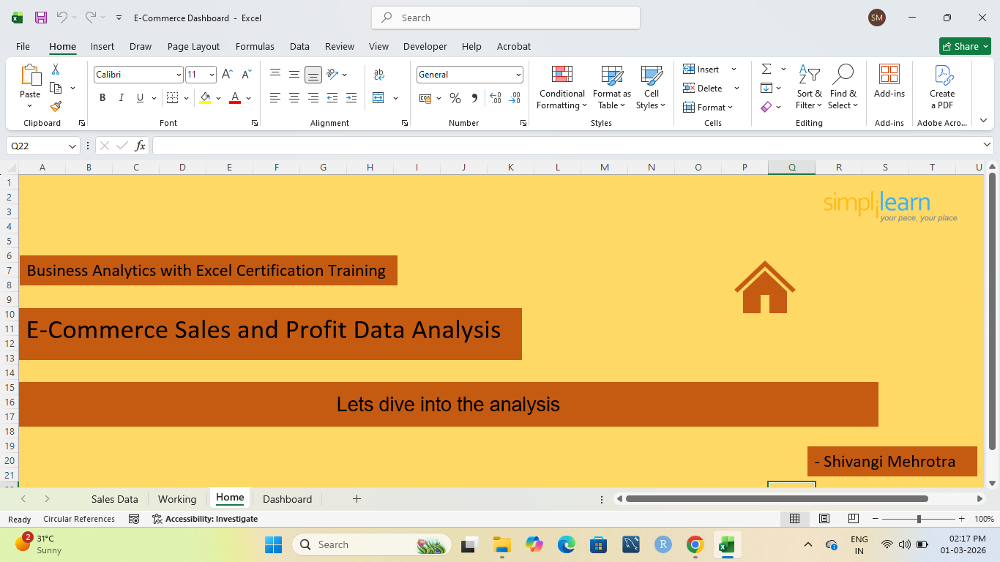
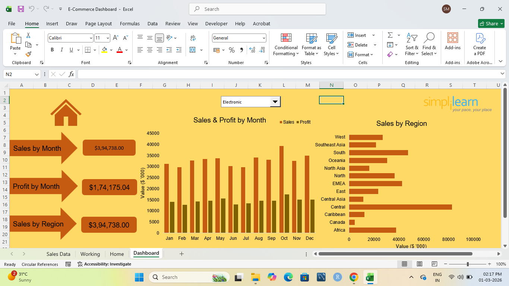
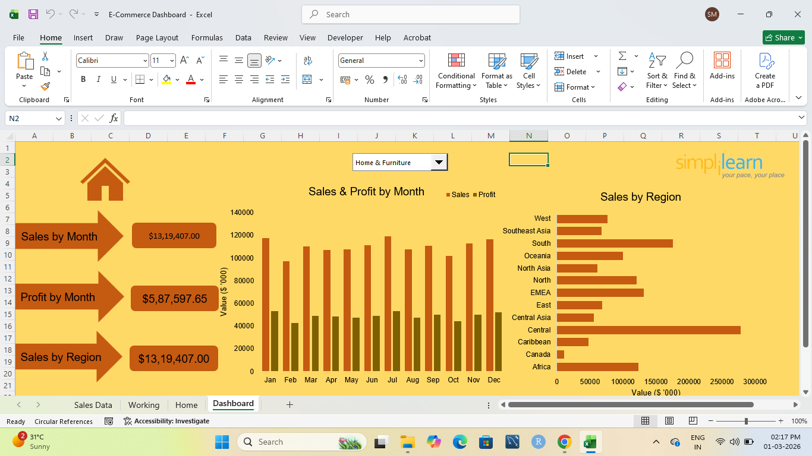
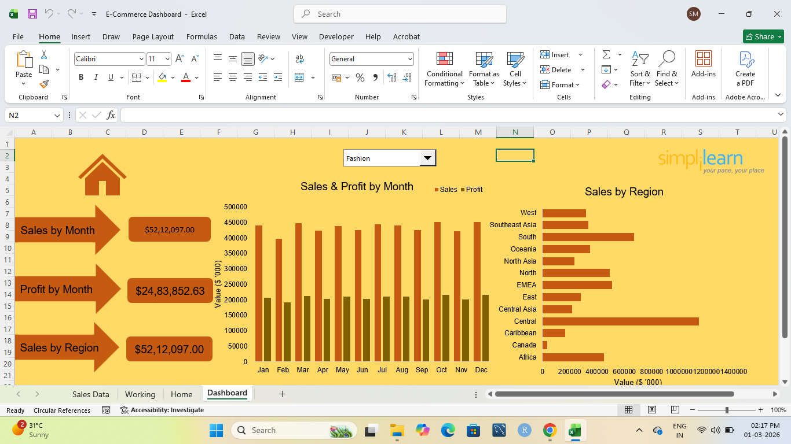

# 📊 E-Commerce Sales Dashboard (Excel)

## 📌 Project Overview
Developed an interactive E-Commerce Sales Dashboard in Microsoft Excel to analyze sales performance, profit trends, and regional distribution. The dashboard helps identify business growth patterns and supports data-driven decision-making.

---

## 🛠 Tools & Techniques Used
- Microsoft Excel
- Pivot Tables
- Pivot Charts
- Slicers / Filters
- Data Cleaning & Transformation
- KPI Card Design

---

## 📊 Key Metrics Tracked
- Total Sales
- Total Profit
- Monthly Sales Trend
- Monthly Profit Trend
- Sales by Region

---

## 🔍 Business Insights
- Identified peak revenue months.
- Compared profit performance across regions.
- Analyzed monthly sales vs profit relationship.
- Evaluated regional contribution to overall revenue.

---

## 📷 Dashboard Preview

### 🔹 Overall KPI & Monthly Trend View

### 🔹 Sales by Region Analysis

### 🔹 Profit Trend Overview

### 🔹 Regional Comparison View

### 🔹 Filtered / Interactive View

---

This project demonstrates my ability to design business-focused dashboards and transform raw sales data into actionable insights.
